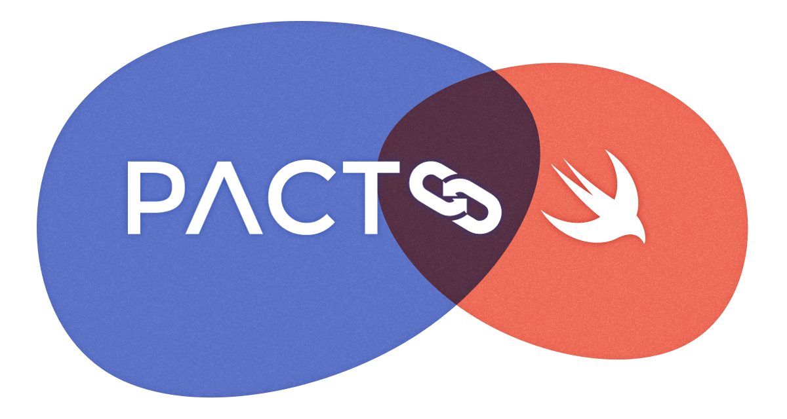

# PactSwift

[](https://github.com/surpher/PactSwift/actions/workflows/build.yml)
[][codecov-io]
[][license]
[][contributing]
[][pact-slack]
[][pact-twitter]

<p align="center">
  
</p>

This framework provides a Swift DSL for generating [Pact][pact-docs] contracts.

It implements [Pact Specification v3][pact-specification-v3] and runs the mock server "in-process". No need to set up any specific mock services or extra tools 🎉.

## Installation

Note: see [Upgrading][upgrading] for notes on upgrading from 0.4 to 0.5

### Swift Package Manager

#### Xcode

1. Enter `https://github.com/surpher/PactSwift` in [Choose Package Repository](./Documentation/images/08_xcode_spm_search.png) search bar
2. Use minimum version `0.6.x` when [Choosing Package Options](./Documentation/images/09_xcode_spm_options.png)
3. Add `PactSwift` to your [test](./Documentation/images/10_xcode_spm_add_package.png) target. Do not embed it in your application target.

#### Package.swift

```sh
dependencies: [
    .package(url: "https://github.com/surpher/PactSwift.git", .upToNextMajor(from: "0.6.0"))
]
```

### Carthage

```sh
# Cartfile
github "surpher/PactSwift" ~> 0.6
```

```sh
carthage update --use-xcframeworks
```

**NOTE:**
- `PactSwift` is intended to be used in your [test target](./Documentation/images/11_xcode_carthage_xcframework.png). Make sure you do not embed it in your main application target.
- If running on `x86_64` (Intel machine) see [Scripts/carthage][carthage_script] ([#3019-1][carthage-issue-3019-1], [#3019-2][carthage-issue-3019-2], [#3201][carthage-issue-3201])

## Generated Pact contracts

By default, generated Pact contracts are written to `/tmp/pacts`. Edit your scheme and add `PACT_OUTPUT_DIR` environment variable (in [`Run`](./Documentation/images/12_xcode_scheme_env_setup.png) section) with path to the directory you want your Pact contracts to be written to.

Sandboxed apps (macOS) are limited in where they can write the Pact contract files. The default location is the `Documents` folder in the sandbox (eg: `~/Library/Containers/com.example.your-project-name/Data/Documents`). Setting the environment variable `PACT_OUTPUT_DIR` might not work without some extra setting. Look at the logs in debug area for the Pact file location.

## Writing Pact tests

- Instantiate a `MockService` object by defining [_pacticipants_][pacticipant],
- Define the state of the provider for an interaction (one Pact test),
- Define the expected `request` for the interaction,
- Define the expected `response` for the interaction,
- Run the test by making the API request using your API client and assert what you need asserted,
- Share the generated Pact contract file with your provider (eg: upload to a [Pact Broker][pact-broker]),
- Run [`can-i-deploy`][can-i-deploy] (eg: on your CI/CD) to deploy with confidence.

### Example Test

```swift
import XCTest
import PactSwift

@testable import ExampleProject

class MockServiceWrapper {
  static let shared = MockServiceWrapper()
  var mockService: MockService

  private init() {
    mockService = MockService(consumer: "Example-iOS-app", provider: "some-api-service")
  }
}

// MARK: - XCTestCase

class PassingTestsExample: XCTestCase {

  var mockService = MockServiceWrapper.shared.mockService

  // MARK: - Tests

  func testGetUsers() {
    // #1 - Define the API contract by configuring how `mockService`, and consequently the "real" API, will behave for this specific API request we are testing here
    mockService

      // #2 - Define the interaction description and provider state for this specific API request that we are testing
      .uponReceiving("A request for a list of users")
      .given(ProviderState(description: "users exist", params: ["first_name": "John", "last_name": "Tester"])

      // #3 - Define the request we promise our API consumer will make
      .withRequest(
        method: .GET,
        path: "/api/users",
        headers: nil, // `nil` means we (and the API Provider) should not care about headers. If there are values there, fine, we're just not _demanding_ anything.
        body: nil // same as with headers
      )

      // #4 - Define what we expect `mockService`, and consequently the "real" API, to respond with for this particular API request we are testing
      .willRespondWith(
        status: 200,
        headers: nil, // `nil` means we don't care what the headers returned from the API are. If there are values in the header, fine, we're just not _demanding_ anything in the header.
        body: [
          "page": Matcher.SomethingLike(1), // We will use matchers here, as we normally care about the types and structure, not necessarily the actual value.
          "per_page": Matcher.SomethingLike(20),
          "total": ExampleGenerator.RandomInt(min: 20, max: 500),
          "total_pages": Matcher.SomethingLike(3),
          "data": Matcher.EachLike(
            [
              "id": ExampleGenerator.RandomUUID(), // We can also use example generators with Pact Spec v3
              "first_name": Matcher.SomethingLike("John"),
              "last_name": Matcher.SomethingLike("Tester"),
              "salary": Matcher.DecimalLike(125000.00)
            ]
          )
        ]
      )

    // #5 - Fire up our API client
    let apiClient = RestManager()

    // Run a Pact test and assert **our** API client makes the request exactly as we promised above
    mockService.run(timeout: 1) { [unowned self] completed in

      // #6 - _Redirect_ your API calls to the address MockService runs on - replace base URL, but path should be the same
      apiClient.baseUrl = self.mockService.baseUrl

      // #7 - Make the API request.
      apiClient.getUsers() { users in

          // #8 - Test that **our** API client handles the response as expected. (eg: `getUsers() -> [User]`)
          XCTAssertEqual(users.count, 20)
          XCTAssertEqual(users.first?.firstName, "John")
          XCTAssertEqual(users.first?.lastName, "Tester")
        }

        // #9 - Notify MockService we're done with our test, else your Pact test will time out.
        completed()
      }
    }
  }

  // More tests for other interactions and/or provider states...
  func testCreateUser() {
    mockService
      .uponReceiving("A request to create a user")
      .given(ProviderState(description: "user does not exist", params: ["first_name": "John", "last_name": "Appleseed"])
      .withRequest(
        method: .POST,
        path: Matcher.RegexLike("/api/group/whoopeedeedoodah/users", term: #"^/\w+/group/([a-z])+/users$"#),
        body: [
          "first_name": "John",
          "last_name": "Appleseed",
          "age": Matcher.SomethingLike(42),
          "dob": Matcher.RegexLike("15-07-2001", term: #"\d{2}-\d{2}-\d{4}"#),
          "trivia": [
            "favourite_words": Matcher.EachLike("foo"),
            "bar": Matcher.IncludesLike("baz")
          ]
        ]
      )
      .willRespondWith(
        status: 201
      )

   let apiClient = RestManager()

    mockService.run { completed in
     // trigger your network request and assert the expectations
     completed()
    }
  }
  // etc.
}
```

`MockService` holds all the interactions between your consumer and a provider. For each test method, a new instance of `XCTestCase` class is allocated and its instance setup is executed.
That means each test has it's own instance of `var mockService = MockService()`. Hence the reason we're using a singleton here to keep a reference to one instance of `MockService` for all the Pact tests.  
Suggestion to improve this are welcome!

References:

- [Issue #67](https://github.com/surpher/PactSwift/issues/67)
- [Writing Tests](https://developer.apple.com/library/archive/documentation/DeveloperTools/Conceptual/testing_with_xcode/chapters/04-writing_tests.html#//apple_ref/doc/uid/TP40014132-CH4-SW36)

## Matching

In addition to verbatim value matching, you can use a set of useful matching objects that can increase expressiveness and reduce brittle test cases.

See [Wiki page about Matchers][matchers] for a list of matchers `PactSwift` implements and their basic usage.

Or peek into [/Sources/Matchers/][pact-swift-matchers].

## Example Generators

In addition to verbatim value matching and some helpful matchers, you can use a set of example generators that generate random values each time you run your tests.

In some cases, dates and times may need to be relative to the current date and time, and some things like tokens may have a very short life span.

Example generators help you generate random values and define the rules around them.

See [Wiki page about Example Generators][example-generators] for a list of example generators `PactSwift` implements and their basic usage.

Or peek into [/Sources/ExampleGenerators/][pact-swift-example-generators].

## Verifying your client against the service you are integrating with

If you set the `PACT_OUTPUT_DIR` environment variable, your Xcode setup is correct and your tests successfully run, then you should see the generated Pact files in:
`$(PACT_OUTPUT_DIR)/_consumer_name_-_provider_name_.json`.

Publish your generated Pact file(s) to your [Pact Broker][pact-broker] or a hosted service, so that your _API-provider_ team can always retrieve them from one location, even when pacts change. Normally you do this regularly in you CI step/s.

See how you can use simple [Pact Broker Client][pact-broker-client] in your terminal (CI/CD) to upload and tag your Pact files. And most importantly check if you can [safely deploy][can-i-deploy] a new version of your app.

## Objective-C support

PactSwift can be used in your Objective-C project with a couple of limitations, e.g. initializers with multiple optional arguments are limited to only one or two available initializers. See [Demo projects repository][demo-projects] for more examples.

```swift
_mockService = [[PFMockService alloc] initWithConsumer:@"Consumer-app" provider:@"Provider-server" transferProtocol:TransferProtocolStandard];
```

`PF` stands for Pact Foundation.

## Demo projects

[][pact-swift-examples-workflow]

More in [pact-swift-examples][demo-projects] repo.

## Contributing

See:

- [CODE_OF_CONDUCT.md][code-of-conduct]
- [CONTRIBUTING.md][contributing]

## Acknowledgements

This project takes inspiration from [pact-consumer-swift](https://github.com/DiUS/pact-consumer-swift) and pull request [Feature/native wrapper PR](https://github.com/DiUS/pact-consumer-swift/pull/50).

Logo and branding images provided by [@cjmlgrto](https://github.com/cjmlgrto).

[action-default]: https://github.com/surpher/PactSwift/actions?query=workflow%3A%22Test+-+Xcode+%28default%29%22
[action-xcode11.5-beta]: https://github.com/surpher/PactSwift/actions?query=workflow%3A%22Test+-+Xcode+%2811.5-beta%29%22
[can-i-deploy]: https://docs.pact.io/pact_broker/can_i_deploy
[carthage_script]: ./Scripts/carthage
[code-of-conduct]: ./CODE_OF_CONDUCT.md
[codecov-io]: https://codecov.io/gh/surpher/PactSwift
[contributing]: ./CONTRIBUTING.md
[demo-projects]: https://github.com/surpher/pact-swift-examples
[example-generators]: https://github.com/surpher/PactSwift/wiki/Example-generators

[github-issues-52]: https://github.com/surpher/PactSwift/issues/52
[issues]: https://github.com/surpher/PactSwift/issues
[license]: LICENSE.md
[matchers]: https://github.com/surpher/pact-swift/wiki/Matchers
[pacticipant]: https://docs.pact.io/pact_broker/advanced_topics/pacticipant/
[pact-broker]: https://docs.pact.io/pact_broker
[pact-broker-client]: https://github.com/pact-foundation/pact_broker-client
[pact-consumer-swift]: https://github.com/dius/pact-consumer-swift
[pactswift-spec2]: https://github.com/surpher/PactSwift_spec2
[pact-docs]: https://docs.pact.io
[pact-reference-rust]: https://github.com/pact-foundation/pact-reference
[pact-slack]: http://slack.pact.io
[pact-specification-v3]: https://github.com/pact-foundation/pact-specification/tree/version-3
[pact-specification-v2]: https://github.com/pact-foundation/pact-specification/tree/version-2
[pact-swift-example-generators]: https://github.com/surpher/PactSwift/tree/main/Sources/ExampleGenerators
[pact-swift-matchers]: https://github.com/surpher/PactSwift/tree/main/Sources/Matchers
[pact-twitter]: http://twitter.com/pact_up
[releases]: https://github.com/surpher/PactSwift/releases
[rust-lang-installation]: https://www.rust-lang.org/tools/install
[slack-channel]: https://pact-foundation.slack.com/archives/C9VBGNT4K

[pact-swift-examples-workflow]: https://github.com/surpher/pact-swift-examples/actions/workflows/test_projects.yml

[upgrading]: https://github.com/surpher/PactSwift/wiki/Upgrading

[carthage-issue-3019-1]: https://github.com/Carthage/Carthage/issues/3019#issuecomment-665136323
[carthage-issue-3019-2]: https://github.com/Carthage/Carthage/issues/3019#issuecomment-734415287
[carthage-issue-3201]: https://github.com/Carthage/Carthage/issues/3201
