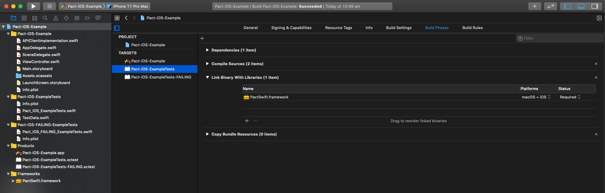

#  PactSwift (beta)

[][license]
[][contributing]
[](https://github.com/surpher/pact-swift/actions)

This framework provides a Swift DSL for generating [Pact](https://docs.pact.io/index.html) contracts.

Implements [Pact Specification v3](https://github.com/pact-foundation/pact-specification/tree/version-3).

The one major advantage of this framework over `pact-consumer-swift` is that it does not depend on Ruby Mock Service to be running on your machine (or on CI/CD agent). Also, it does not require you to fiddle with test pre-actions and post-actions.

⚠️ **Note:** _pact-swift_ is under heavy development and not all features are complete.

## Installation

### Carthage

```
// Cartfile
github "surpher/pact-swift" "v0.1"
```

```
carthage update --platform ios --no-use-binaries
```

### Swift Package Manager

```
WIP
```

## Xcode setup - Carthage

**NOTE:** This framework is intended to be used in your test target. Do not embed it into your app bundle!

### Setup test target Build Phase

`Test Target` > `Build Settings` > `Link Binary With Libraries` > `Add Other` > `Add Files...`
Find your Carthage folder, `$(PROJECT_DIR)/Carthage/Build/iOS/` and select `PactSwift.framework` to link it to your test target that will run Pact tests:



### Setup Framework Build Settings

#### Framework Search Paths

In your test targets build settings, update `Framework Search Paths` configuration to include `$(PROJECT_DIR)/Carthage/Build/iOS (non-recursive)`:


#### Runpath Search Paths

In your test targets build settings, update `Runpath Search Paths` configuration to include `$(FRAMEWORK_SEARCH_PATHS)`:


#### Destination dir (recommended)

Edit your scheme and add `PACT_DIR` environment variable (`Run` step) with path to the directory you want your Pact contracts to be written to. By default, Pact contracts are written to `/tmp/pacts`.


## Writing Pact tests

1. Describe the interaction (between your API consumer and API provider),
2. Define the specific state of the provider for the interaction,
3. Define the expected `request` for the interaction,
4. Define the expected `response` for the interaction,
5. Run your code that makes the API request and test its handling of the API response,
6. Finalize the Pact tests and generate a Pact contract,
7. Share the generated Pact contract with provider (eg: upload to a Pact Broker).

```swift
import XCTest
import PactSwift

@testable import ExampleProject

class PassingTestsExample: XCTestCase {

  var mockService = MockService(consumer: "Example-iOS-app", provider: "users-service")

  override func tearDown() {
    super.tearDown()
    // #6
    mockService.finalize { result in
      switch result {
        case .success(let result): debugPrint(result)
        case .failure(let error): debugPrint(error.description)
      }
    }
  }

  // MARK: - Tests

  func testGetsUsers() {
    // Setup the test and expectations
    // #1
    _ = mockService
      .uponReceiving("A request for a list of users")
      // #2
      .given(ProviderState(description: "users exist", params: ["total_pages": "493"])
      // #3
      .withRequest(
        method: .GET,
        path: "/api/users",
        headers: nil,
        body: nil
      )
      // #4
      .willRespondWith(
        status: 200,
        headers: nil,
        body: [
          "page": SomethingLike(1),
          "per_page": SomethingLike(25),
          "total": SomethingLike(1234),
          "total_pages": SomethingLike(493),
          "data": EachLike(
            [
              "id": IntegerLike(1),
              "first_name": SomethingLike("John"),
              "last_name": SomethingLike("Tester"),
              "salary": DecimalLike(125000.00)
            ]
          )
        ]
      )

    // Define the system under test (optional - depends on your implementation of your API client)
    let apiClient = RestManager()

    // Execute Pact test
    // #5
    mockService.run { [unowned self] completed in
      // _Redirect_ your API calls to the address MockService runs on - replace base URL, but path should be the same
      guard let url = URL(string: "\(self.mockService.baseUrl)/api/users") else {
        XCTFail("Failed to prepare url!")
        return
      }

      apiClient.makeRequest(toURL: url, withHttpMethod: .get) { results in
        if let data = results.data {
          let decoder = JSONDecoder()
          decoder.keyDecodingStrategy = .convertFromSnakeCase
          guard let userData = try? decoder.decode(UserData.self, from: data) else {
            XCTFail("Failed to decode UserData")
            completed() // Notify MockService we're done with our test
            return
          }

          // test your API client based on expected response
          XCTAssertEqual(userData.page, 1)
          XCTAssertEqual(userData.data?.first?.firstName, "John")
          XCTAssertEqual(userData.data?.first?.lastName, "Tester")
        }
        completed() // Notify MockService we're done with our test
      }
    }
  }

  // more tests...
}
```

## Matching

In addition to verbatim value matching, you can use a set of useful matching objects that can increase expressiveness and reduce brittle test cases.

Example matchers:

- `SomethingLike(_)` - tells Pact that the value itself is not important, as long as the element type (valid JSON number, string, object conforming to `Codable` protocol etc.) itself matches.
- `EachLike(type:min:max:)` - tells Pact that the value should be an array type, consisting of elements like those passed in, where `min` must be greater or eaqualt to 1. Content may be a valid JSON value: e.g. strings, numbers, objects conforming to `Codable` protocol or other matchers.

See [Wiki page about Matchers](https://github.com/surpher/pact-swift/wiki/Matchers) for a list of matchers `PactSwift` implements and their basic usage.

See the [Demo projects][demo-projects] for examples.

## Example Generators

⚠️  _Work in progress_ ⚠️ 

## Verifying your client against the service you are integrating with

If you set the `PACT_DIR` environment variable, your Xcode setup is correct and your tests successfully run, then you should see the generated Pact files in:
`$(PROJECT_DIR)/tmp/pacts/_consumer_name-provider_name.json`.

Publish your generated Pact file(s) to your [Pact Broker](https://docs.pact.io/pact_broker) or a hosted service, so that your _API provider_ team can always retrieve them from one location, even when pacts change.

See how you can use simple [Pact Broker Client](https://github.com/pact-foundation/pact_broker-client) in your terminal (CI/CD) to upload and tag your Pact files. And most importantly check if you can [safely deploy](https://docs.pact.io/pact_broker/can_i_deploy) a new version of your app.

## Demo projects

See [pact-swift-examples][demo-projects] repository.

## Contributing

See [CODE_OF_CONDUCT.md](CODE_OF_CONDUCT.md)  
See [CONTRIBUTING.md](CONTRIBUTING.md)

## Acknowledgements

This project takes guidance from ideas and implementation examples in [pact-consumer-swift](https://github.com/DiUS/pact-consumer-swift) and pull request [Feature/native wrapper PR](https://github.com/DiUS/pact-consumer-swift/pull/50).

[license]: LICENSE
[contributing]: CONTRIBUTING.md
[code-of-conduct]: CODE_OF_CONDUCT.md
[demo-projects]: https://github.com/surpher/pact-swift-examples