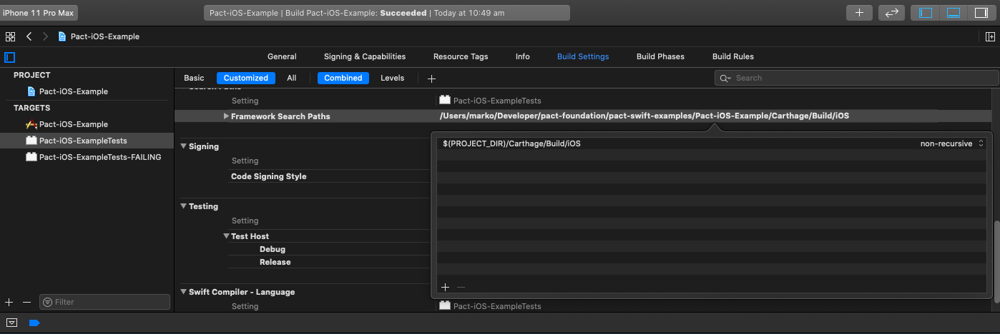
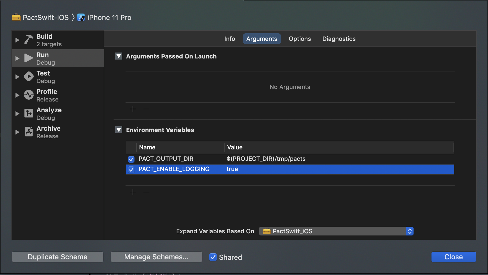

# PactSwift

[][releases]
[][license]
[][contributing]
[][carthage]
[][pact-slack]
[][pact-twitter]
[][codecov-io]
[/badge.svg)][github-action-xcode11.5]
[/badge.svg)][github-action-xcode12beta]


> ⚠️ **NOTE** ⚠️  
> _pact-swift_ is under heavy development and not all features are complete.
> Not everything is documented properly.

This framework provides a Swift DSL for generating [Pact][pact-docs] contracts.

Implements [Pact Specification v3][pact-specification-v3].

The one major advantage of this framework over [`pact-consumer-swift`][pact-consumer-swift] is that it does not depend on Ruby Mock Service to be running on your machine (or on CI/CD agent). Also, it does not require you to fiddle with test pre-actions and post-actions.

## Installation

### Carthage

```sh
github "surpher/PactSwift" ~> 0.1
```

```sh
carthage update --platform ios --no-use-binaries
```

### Swift Package Manager (beta)

Add `PactSwift` as a dependency to your test target in `Package.swift`:

```sh
...
dependencies: [
	.package(url: "https://github.com/surpher/PactSwift.git", .branch("master"))
],
...
```

Run tests in terminal by providing path to static lib as a linker flag:

    swift test -Xlinker -LRelativePathTo/libFolder

⚠️ Using `PactSwift` through SPM requires you to link a `libpact_mock_server.a` for the appropriate architecture. You can find them in `/Resources/` folder.

You can compile a custom lib from [pact-reference/rust][pact-reference-rust] codebase.

We're actively looking for an alternative approach to using static libs with SPM!

## Xcode setup - Carthage

**NOTE:** This framework is intended to be used in your test target. Do not embed it into your app bundle!

### Setup Framework Build Settings

#### Framework Search Paths

In your test targets build settings, update `Framework Search Paths` configuration to include `$(PROJECT_DIR)/Carthage/Build/iOS (non-recursive)`:



#### Runpath Search Paths

In your test targets build settings, update `Runpath Search Paths` configuration to include `$(FRAMEWORK_SEARCH_PATHS)`:


#### Destination dir (recommended)

Edit your scheme and add `PACT_DIR` environment variable (`Run` step) with path to the directory you want your Pact contracts to be written to. By default, Pact contracts are written to `/tmp/pacts`.

⚠️ Sandboxed apps are limited in where they can write the Pact contract file. The default location is the `Documents` folder in the sandbox (eg: `~/Library/Containers/com.example.your-project-name/Data/Documents`) and *can not* be overriden by the environment variable `PACT_DIR`.



## Writing Pact tests

- Instantiate a `MockService` object by defining _pacticipants_,
- Define the state of the provider for an interaction (one Pact test),
- Define the expected `request` for the interaction,
- Define the expected `response` for the interaction,
- Run the test by making the API request using your API client and assert what you need asserted,
- Share the generated Pact contract file with your provider (eg: upload to a [Pact Broker][pact-broker]),
- Run [`can-i-deploy`][can-i-deploy] (eg: on your CI/CD) to deploy with confidence.

### Example Test

```swift
import XCTest
import PactSwift

@testable import ExampleProject

class PassingTestsExample: XCTestCase {

  var mockService = MockService(consumer: "Example-iOS-app", provider: "some-service")

  // MARK: - Tests

  func testGetUsers() {
    // #1 - Define the API contract by configuring how `mockService`, and consequently the "real" API, will behave for this specific API request we are testing here
    _ = mockService

      // #2 - Define the interaction description and provider state for this specific API request that we are testing
      .uponReceiving("A request for a list of users")
      .given(ProviderState(description: "users exist", params: ["first_name": "John", "last_name": "Tester"])

      // #3 - Define the request we promise our API consumer will make
      .withRequest(
        method: .GET,
        path: "/api/users",
        headers: nil, // `nil` means we (and the API Provider) should not care about headers. If there are values there, fine, we're just not _demanding_ anything.
        body: nil // same as with headers
      )

      // #4 - Define what we expect `mockService`, and consequently the "real" API, to respond with for this particular API request we are testing
      .willRespondWith(
        status: 200,
        headers: nil, // `nil` means we don't care what the headers returned from the API are. If there are values in the header, fine, we're just not _demanding_ anything in the header.
        body: [
          "page": SomethingLike(1), // We will use matchers here, as we normally care about the types and structure, not necessarily the actual value.
          "per_page": SomethingLike(20),
          "total": SomethingLike(58),
          "total_pages": SomethingLike(3),
          "data": EachLike(
            [
              "id": IntegerLike(1),
              "first_name": SomethingLike("John"),
              "last_name": SomethingLike("Tester"),
              "salary": DecimalLike(125000.00)
            ]
          )
        ]
      )

    // #5 - Fire up our API client
    let apiClient = RestManager()

    // Run a Pact test and assert our API client makes the request exactly as we promised above
    mockService.run(waitFor: 1) { [unowned self] completed in

      // #6 - _Redirect_ your API calls to the address MockService runs on - replace base URL, but path should be the same
      apiClient.baseUrl = self.mockService.baseUrl

      // #7 - Make the API request.
      apiClient.getUsers() { users in

          // #8 - Test that the API client handles the response as expected. (eg: `getUsers() -> [User]`)
          XCTAssertEqual(users.count, 20)
          XCTAssertEqual(users.first?.firstName, "John")
          XCTAssertEqual(users.first?.lastName, "Tester")
        }

        // #9 - Notify MockService we're done with our test, else your Pact test will time out.
        completed()
      }
    }
  }

  // More tests for other interactions and/or provider states...
  func testGetUsers_Unauthorised() {
    // ... code
  }
  // etc.
}
```

## Matching

In addition to verbatim value matching, you can use a set of useful matching objects that can increase expressiveness and reduce brittle test cases.

See [Wiki page about Matchers][matchers] for a list of matchers `PactSwift` implements and their basic usage.

Or peek into [/Sources/Matchers/][pact-swift-matchers].

## Example Generators

⚠️  _Work in progress_ ⚠️

## Verifying your client against the service you are integrating with

If you set the `PACT_DIR` environment variable, your Xcode setup is correct and your tests successfully run, then you should see the generated Pact files in:
`$(PACT_DIR)/_consumer_name_-_provider_name_.json`.

Publish your generated Pact file(s) to your [Pact Broker][pact-broker] or a hosted service, so that your _API-provider_ team can always retrieve them from one location, even when pacts change.

See how you can use simple [Pact Broker Client][pact-broker-client] in your terminal (CI/CD) to upload and tag your Pact files. And most importantly check if you can [safely deploy][can-i-deploy] a new version of your app.

## Demo projects

See [pact-swift-examples][demo-projects] repo.

## Contributing

See [CODE_OF_CONDUCT.md][code-of-conduct]  
See [CONTRIBUTING.md][contributing]

## Acknowledgements

This project takes inspiration from [pact-consumer-swift](https://github.com/DiUS/pact-consumer-swift) and pull request [Feature/native wrapper PR](https://github.com/DiUS/pact-consumer-swift/pull/50).

Logo and branding images provided by [@cjmlgrto](https://github.com/cjmlgrto).

[action-default]: https://github.com/surpher/PactSwift/actions?query=workflow%3A%22Test+-+Xcode+%28default%29%22
[action-xcode11.5-beta]: https://github.com/surpher/PactSwift/actions?query=workflow%3A%22Test+-+Xcode+%2811.5-beta%29%22
[can-i-deploy]: https://docs.pact.io/pact_broker/can_i_deploy
[carthage]: https://github.com/Carthage/Carthage
[code-of-conduct]: ./Documentation/CODE_OF_CONDUCT.md
[codecov-io]: https://codecov.io/gh/surpher/PactSwift
[contributing]: ./Documentation/CONTRIBUTING.md
[demo-projects]: https://github.com/surpher/pact-swift-examples
[github-action-xcode11.4]: https://github.com/surpher/PactSwift/actions?query=workflow%3A%22Run+tests+%2811.4%29%22
[github-action-xcode11.5]: https://github.com/surpher/PactSwift/actions?query=workflow%3A%22Run+tests+%2811.5%29%22
[github-action-xcode12beta]: https://github.com/surpher/PactSwift/actions?query=workflow%3A%22Run+tests+%2812beta%29%22
[issues]: https://github.com/surpher/PactSwift/issues
[license]: LICENSE.md
[matchers]: https://github.com/surpher/pact-swift/wiki/Matchers
[pact-broker]: https://docs.pact.io/pact_broker
[pact-broker-client]: https://github.com/pact-foundation/pact_broker-client
[pact-consumer-swift]: https://github.com/dius/pact-consumer-swift
[pact-docs]: https://docs.pact.io
[pact-reference-rust]: https://github.com/pact-foundation/pact-reference/tree/master/rust/pact_mock_server_ffi
[pact-slack]: http://slack.pact.io
[pact-specification-v3]: https://github.com/pact-foundation/pact-specification/tree/version-3
[pact-swift-matchers]: https://github.com/surpher/PactSwift/tree/master/Sources/Matchers
[pact-twitter]: http://twitter.com/pact_up
[releases]: https://github.com/surpher/PactSwift/releases
